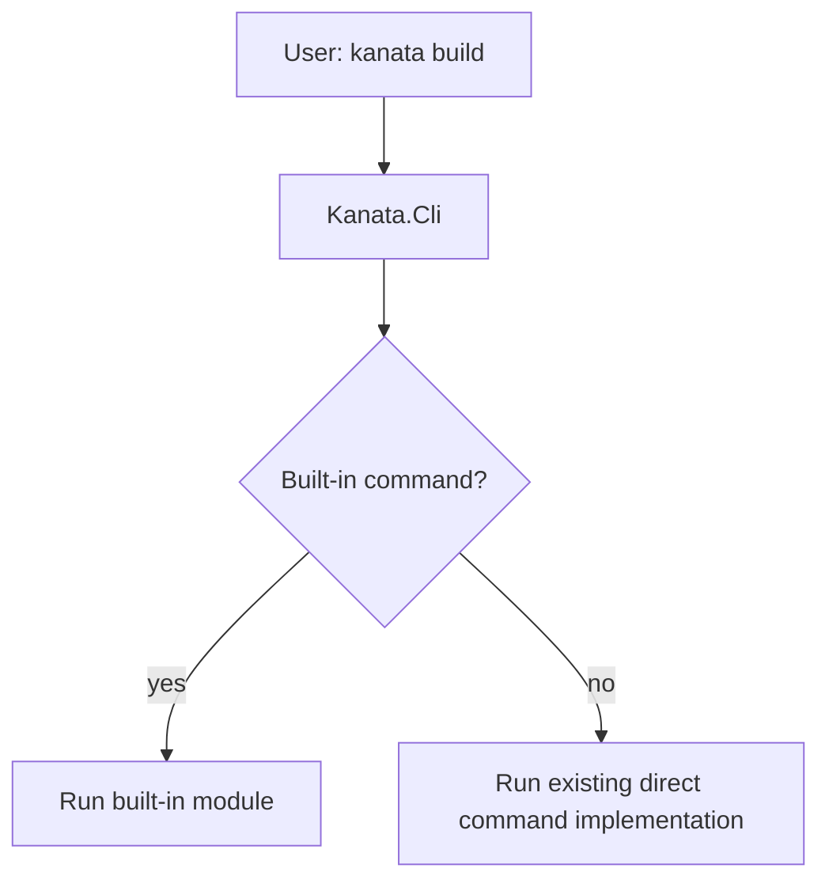
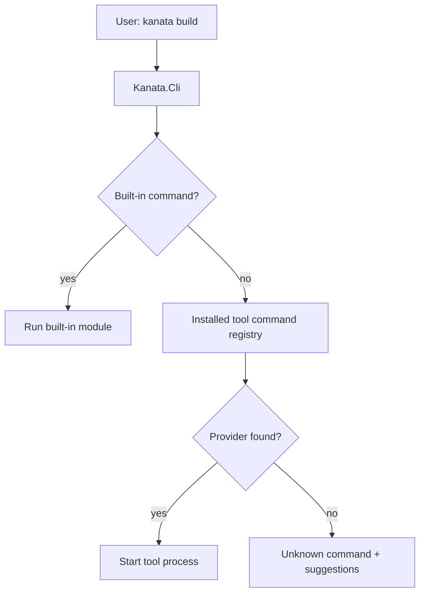

# Kanata CLI bootstrap host v1

Status: current architecture target for the installed `kanata` entrypoint.  
Scope: bootstrap responsibilities, built-in modules, packageable tool boundaries, and command dispatch direction.

## Role

`Kanata.Cli` is the installed command-line entrypoint for Kanata.

```text
Kanata.Cli = bootstrap host + built-in package manager + command router foundation
```

The executable command name is:

```text
kanata
```

`Kanata.Cli` is not the build tool itself. It owns the stable entrypoint and dispatches commands to built-in modules or tool-provided command surfaces.

## Built-in responsibilities

The following functionality is part of the installed Kanata CLI distribution:

| Area | Responsibility |
|---|---|
| CLI entrypoint | Provide the `kanata` command. |
| Help/version | Keep basic CLI UX available even if packages are missing. |
| Packaging | Read, verify, pack, install, list, and inspect `.kpkg` packages. |
| Package store | Manage the local Kanata package store layout. |
| Installed registry | Track installed package records. |
| Tool visibility | List and inspect installed tool packages, commands, and optional UI surfaces. |
| Command routing foundation | Reserve the place where future package-provided commands will be dispatched. |

Packaging is built-in because Kanata must be able to install or repair tool packages without depending on a package manager that is itself installed as a package.

## Packageable tools

These parts should be packageable tool components:

| Package | Kind | Commands / surfaces |
|---|---|---|
| `kanata.project` | `tool` | `create`, `new`, `validate` |
| `kanata.build` | `tool` | `restore`, `generate`, `build`, `play`, `engine` |
| `kanata.package.explorer` | `tool` | package CLI helpers and optional GUI surface for package inspection and package store management |
| `kanata.engineer` | `tool` | future engineering commands and optional UI surface |

## Command dispatch model

Current implementation:



Target implementation:



Built-in commands have priority over installed tool commands. Installed packages must not override bootstrap commands such as `package`, `tool`, `version`, or `help`.

## Tool process boundary

External tool commands should be launched as separate processes instead of loading tool assemblies into `Kanata.Cli`.

Supported entrypoint kinds for the first command-routing implementation should be:

```text
dotnet-assembly
native-executable
```

Scripts and shell commands are deferred because they require additional platform and security rules.

## UI Hub boundary

The Kanata UI Hub is a management surface for humans. It must not replace the CLI bootstrap host.

The CLI remains responsible for:

```text
package installation
package repair
package inspection
tool command routing
automation-friendly commands
```

The Hub can use the same package services, installed registry, and tool surface metadata. Tool packages may declare optional GUI surfaces that the Hub or standalone launchers can expose later.
