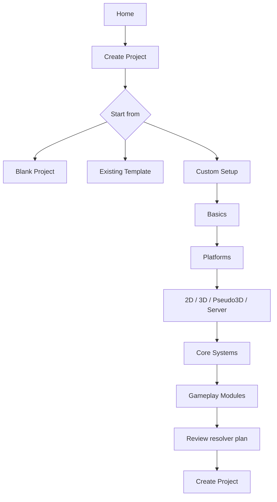

# Kanata Hub information architecture v1

Status: product direction draft.
Scope: user-facing structure for Kanata Hub before rebuilding the Avalonia UI.

## Product direction

Kanata Hub is project-first.

The first user-facing object is a game project. Templates and components support project creation and maintenance. Packages, tools, dependency graphs, exact install paths, hashes, and resolver internals are infrastructure and must not dominate the first screen.

Core statements:

```text
Projects are the primary user workspace.
Templates are recipes for project setup.
Library contains components.
Engine is maintenance/build infrastructure.
Settings contains user preferences and paths.
Environment is maintenance and diagnostics.
Packages are transport/install artifacts, not primary Hub entities.
```

## Navigation

Hub V1 uses this top-level navigation:

```text
Kanata Hub
├─ Home
├─ Templates
├─ Library
├─ Engine
├─ Settings
└─ Environment
```

Visual priority:

```text
Primary:
  Home
  Templates
  Library

Secondary:
  Engine
  Settings
  Environment
```

`Environment` must stay visually quiet. It exists for maintenance, repair, version locks, installed tools, package store diagnostics, and advanced dependency inspection.

## Interface layers

Every page should follow three layers.

### Layer 1: first glance

User-friendly. Minimal. Shows only the next useful actions and short statuses.

Examples:

```text
Create project
Open project
Recent projects
Use template
Search components
Build engine
Environment OK
```

Do not show here:

```text
package hashes
raw manifests
block tables
file tables
install paths
full dependency graphs
installed tool dump
resolver cache
```

### Layer 2: experienced user

Configuration and operational details.

Examples:

```text
project target platforms
used components
locked versions
missing components
template recipe
component versions
backend platform variants
update candidates
```

### Layer 3: technical details

Advanced inspection. Must be available, but not visually noisy.

Examples:

```text
raw descriptor
resolved graph
lock file
exact package ids
install paths
package source
hashes
logs
```

Layer 3 is accessed through explicit affordances such as:

```text
Advanced
Show technical details
View resolver graph
Open package details
Open in Package Explorer
```

## Home

Home is the first tab and combines the old Projects landing area with project creation.

Home answers:

```text
What project can I continue?
How do I create a new project?
How do I open an existing project?
Can I start from a basic template quickly?
```

Home does not answer:

```text
Which packages are installed?
What are the package hashes?
Which tools are installed?
What is the block table?
```

### Home structure

```text
Home
├─ Header
│  ├─ Kanata Hub
│  └─ Create, open or continue a game project.
│
├─ Primary actions
│  ├─ Create Project
│  ├─ Open Project
│  └─ Browse Templates
│
├─ Main content
│  ├─ Recent Projects
│  │  └─ Project cards
│  │
│  └─ New Project
│     ├─ Blank
│     ├─ From Template
│     ├─ Custom Setup
│     └─ Compact basic template builder
│
└─ Quiet footer
   └─ Environment OK / Needs attention
```

### Home first view

The first view should be close to Unreal-style project browsing:

```text
┌─────────────────────────────────────────────────────────────┐
│ Kanata Hub                                                  │
│ Create, open or continue a project.                        │
│                                                             │
│ [Create Project] [Open Project] [Browse Templates]          │
├──────────────────────────────┬──────────────────────────────┤
│ Recent Projects              │ New Project                  │
│                              │                              │
│ ┌ GridDefense ─────────────┐ │ Start from                   │
│ │ 2D Strategy · Windows    │ │ [Blank] [Template] [Custom]  │
│ │ Last opened today        │ │                              │
│ │ [Open]                  │ │ Platform                     │
│ └──────────────────────────┘ │ [Windows] [Linux] [+]        │
│                              │                              │
│ ┌ DialogueSandbox ────────┐ │ Game type                    │
│ │ Visual Novel · Desktop  │ │ [2D] [3D] [Pseudo3D]         │
│ │ [Open]                  │ │                              │
│ └──────────────────────────┘ │ [Create Project]             │
└──────────────────────────────┴──────────────────────────────┘
```

### Recent project card

Layer 1 card:

```text
GridDefense
2D Strategy · Windows
D:\Dev\Projects\GridDefense

[Open]
```

Layer 2 after selection or expansion:

```text
Template: 2D Strategy
Platforms: Windows
Status: Ready

[Open] [Build] [Play] [Project Settings]
```

Layer 3:

```text
Resolved graph
Lock file
Exact package ids
Install paths
```

## New project flow

Project creation starts on Home.

```text
Create Project
├─ Blank Project
├─ From Template
└─ Custom Setup
```

### Blank Project

Minimal input:

```text
Name
Location
Platform
Game type

[Create]
```

### From Template

```text
Select template
Adjust platform
Adjust backend preference
Create
```

### Custom Setup

Custom Setup is a compact basic template builder for a new project. It may open a wizard/modal when advanced choices are needed.

Compact Home builder:

```text
New Project

Project name: [          ]
Location:     [          ]

Start from:
( ) Blank
( ) Existing template
( ) Custom setup

Platform:
[Windows] [Linux] [Web] [+]

Game type:
[2D] [3D] [Pseudo3D] [Server]

Recommended setup:
[Create Project]
```

Advanced Custom Setup wizard:

```text
Create Project / Custom Setup
├─ Basics
├─ Platforms
├─ Game Type
├─ Core Systems
├─ Gameplay Modules
├─ Review
└─ Create Project
```

Flow:



## Template/component selection model

The user selects capabilities, not package ids.

Bad first-layer choices:

```text
kanata.renderer.2d
kanata.backend.monogame.win-x64
kanata.dialogue.runtime
```

Good first-layer choices:

```text
Rendering: 2D
Platforms: Windows, Linux
Gameplay: Dialogue, Economy, Buildings
Systems: ECS, Events, Input, Assets
```

The technical review may show the component plan:

```text
Kanata will use:
- Kanata Core
- MonoGame backend for Windows
- 2D Renderer
- Dialogue module
- Economy module
```

Technical details stay behind:

```text
Show technical component plan
```

## Templates

Templates are second in priority after Home.

Purpose:

```text
create templates separately
edit local templates
download ready templates
duplicate/customize templates
create project from template
```

Structure:

```text
Templates
├─ Local Templates
├─ Remote Templates
├─ Create Template
└─ Template Details
```

Minimal first view:

```text
Templates

[Create Template] [Import Template]

Local Templates:
  2D Strategy
  Visual Novel
  Platformer

Remote Templates:
  Browse library...
```

Template details:

```text
2D Strategy

Platforms: Windows, Linux
Game type: 2D
Includes:
  ECS
  Events
  Input
  Buildings
  Economy

[Create Project From This] [Edit] [Duplicate]
```

## Library

Library contains components only. It is not a projects page, not a packages page, and not an environment dashboard.

Structure:

```text
Library
├─ Search
├─ Filters
├─ Component List
└─ Component Details
```

Filters:

```text
All
Installed
Updates
Backends
Core
Rendering
Gameplay
Assets
```

Component card:

```text
Dialogue
Gameplay Component

Installed: 0.4.1
Latest: 0.4.1
Used by: 2 projects

[Details]
```

Component details:

```text
Dialogue

Purpose:
Adds branching dialogue runtime and authoring support.

Versions:
0.4.1 installed
0.3.2 installed, used by OldVN

Dependencies:
Kanata Core >= 0.1.0

[Install] [Update] [Versions]
```

Backend details must expose platform variants:

```text
MonoGame Backend

Windows x64: installed
Windows x86: missing
Linux x64: available
macOS arm64: available

[Install variants] [Details]
```

Layer 3 for components:

```text
package id
manifest
dependency graph
install path
raw descriptor
```

## Engine

Engine is not the project build page. It is for engine/build infrastructure and backend artifacts.

Structure:

```text
Engine
├─ Engine status
├─ Build Engine
├─ Backends
└─ Build logs
```

First layer:

```text
Engine

Current: Kanata 0.1.0
Status: Ready

[Build Engine] [Rebuild Backends]
```

Backend capability view:

```text
Backends:
  MonoGame Windows x64 installed
  MonoGame Linux x64 missing
  Web backend not installed
```

Layer 3:

```text
build cache
generated artifacts
backend package mapping
build logs
```

## Settings

Settings contains user preferences and paths.

Structure:

```text
Settings
├─ General
├─ Paths
├─ Package Sources
├─ Updates
├─ Appearance
└─ About
```

About/Info is a Settings section, not a primary page.

About contains:

```text
Kanata version
CLI path
Hub version
Package store path
Cache path
repository/source info
diagnostics export
```

## Environment

Environment is maintenance mode.

It must not be the first user-facing surface and must not show full package dumps by default.

Structure:

```text
Environment
├─ Health
├─ Tools
├─ Critical Components
├─ Version Locks
├─ Package Store
└─ Advanced
```

First layer:

```text
Environment

Status: OK

[Check Environment] [Repair] [Update Tools]
```

Second layer:

```text
Tools:
  Kanata CLI latest
  Kanata Hub latest
  Build tool latest

Critical components:
  Kanata Core installed
  ECS installed
  Events installed

Project locks:
  DialogueSandbox uses dialogue 0.3.2
```

Third layer:

```text
package registry
exact install paths
resolver cache
broken packages
hashes
```

## Package Explorer boundary

`.kpkg` files are not a primary Hub page.

They belong to a separate tool:

```text
Kanata Package Explorer
```

Purpose:

```text
Open .kpkg
Verify
Install
Pack folder
View manifest
View descriptors
View file table
View blocks
Context menu integration
```

Hub may link to it from advanced places:

```text
Component Details -> Open package
Environment -> Package Store -> Open in Package Explorer
```

## Entity rules

```text
Project
  primary user object
  stores intent, used components, target platforms
  does not store tools
  does not store plugins
  does not expose packages on layer 1

Template
  recipe for project setup
  selects capabilities/components/backends/options

Component
  runtime/build-time engine module
  can participate in project graph

Backend
  component subtype
  has platform compatibility matrix

Tool
  environment/toolchain capability
  does not participate in project runtime graph

Plugin
  editor/Hub/tooling extension
  does not participate in project runtime graph

Package
  transport/install artifact
  not a primary Hub entity
```

## Non-goals for first UI rewrite

Do not implement in the first product-first Hub pass:

```text
marketplace transactions
remote registry protocol
full package explorer inside Hub
uninstall/repair automation
project build UI
embedded terminal
runtime/editor UI
full resolver graph UI by default
```

The first rewrite should build:

```text
Home
Templates
Library
Engine
Settings
Environment
```

with Home implemented as the first real screen.

