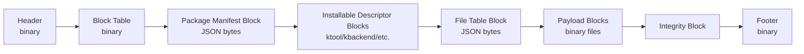

# Kanata package format v1

Status: draft  
Extension: `.kpkg`  
Scope: binary package container for Kanata components and tools

## Purpose

`.kpkg` is the Kanata package container format.

It stores:

- package metadata;
- installables index;
- canonical installable descriptors;
- payload files;
- file table;
- integrity data.

A `.kpkg` file is not just an archive. It is a package container with explicit Kanata semantics.

## Design goals

V1 goals:

- support runtime, backend, tool, editor, and plugin components;
- support one or more installables per package;
- allow pre-install package inspection without reading payload;
- avoid changing binary layout when new component kinds are added;
- keep type-specific metadata in descriptor blocks;
- keep payload files separate from metadata;
- verify package integrity before installation;
- avoid install-time code execution.

Non-goals for V1:

- remote registry protocol;
- package signatures;
- sandboxing;
- permission system;
- remote execution;
- capability resolver;
- delta packages;
- streaming installation;
- GUI installer.

## High-level structure

```text
.kpkg
  Header
  BlockTable
  PackageManifestBlock
  InstallableDescriptorBlock[]
  FileTableBlock
  PayloadBlock[]
  IntegrityBlock
  Footer
```

The binary container knows generic block types only.

It does not define separate block types for `tool`, `backend`, `runtime`, or future component kinds.

## Container layout



## Block types

| Block | Required | Count | Description |
|---|---:|---:|---|
| `Header` | yes | 1 | Magic, format version, offsets. |
| `BlockTable` | yes | 1 | Block index with offsets, lengths, hashes. |
| `PackageManifest` | yes | 1 | Package metadata and installables index. |
| `InstallableDescriptor` | yes | 1..N | Full typed descriptor: `ktool`, `kbackend`, etc. |
| `FileTable` | yes | 1 | Payload paths, offsets, lengths, hashes. |
| `Payload` | no | 0..N | Real file bytes. |
| `Integrity` | yes | 1 | Integrity metadata. |
| `Footer` | yes | 1 | Whole-package hash/check data. |

## Package manifest

Package manifest answers:

```text
What package is this?
Which installables does it contain?
What basic information is needed before installation?
Where are the full descriptors?
```

Example:

```json
{
  "format": "kanata.package",
  "schemaVersion": 1,
  "packageId": "kanata.engineer",
  "version": "0.1.0",
  "displayName": "Kanata Engineer",
  "description": "Official engineering tool for Kanata.",
  "installables": [
    {
      "id": "kanata.engineer",
      "version": "0.1.0",
      "kind": "tool",
      "description": "Official engineering tool for Kanata.",
      "provides": ["kanata.engineering"],
      "dependencies": [],
      "compatibility": {
        "kanataToolVersion": "[0.1.0,)",
        "platforms": ["windows"],
        "architectures": ["x64", "arm64"]
      },
      "gameParticipation": {
        "build": false,
        "runtime": false
      },
      "descriptorBlockId": 2
    }
  ]
}
```

The installables index must contain only base component metadata.

It must not contain type-specific data such as:

- `commands`;
- backend entry types;
- plugin hooks;
- template variables;
- asset processor pipelines.

Those fields belong to installable descriptor blocks.

## Installable descriptor block

Each installable has one descriptor block.

Descriptor block contains the full canonical metadata for a component.

Examples:

```text
kanata.tool descriptor
kanata.backend descriptor
kanata.component descriptor
kanata.plugin descriptor
```

Rules:

- descriptor block is not payload;
- descriptor block may be read before installation;
- descriptor block is referenced by `descriptorBlockId`;
- descriptor block contains type-specific fields;
- adding a new component kind should add a new descriptor schema, not a new binary block type.

## File table

The file table maps payload paths to byte ranges.

Example:

```json
{
  "format": "kanata.package.fileTable",
  "schemaVersion": 1,
  "files": [
    {
      "path": "tools/kanata.engineer/Kanata.Engineer.dll",
      "payloadBlockId": 10,
      "payloadOffset": 0,
      "storedLength": 120000,
      "length": 300000,
      "compression": "none",
      "sha256": "..."
    }
  ]
}
```

Rules:

- paths must be relative;
- paths must use `/`;
- absolute paths are forbidden;
- `..` segments are forbidden;
- backslashes are forbidden;
- duplicate paths are forbidden;
- case-insensitive duplicate collisions are forbidden on Windows;
- each file hash is calculated from uncompressed content;
- payload cannot be trusted until verified.

## Payload

Payload contains real file bytes.

Examples:

```text
lib/net8.0/Kanata.Backend.MonoGame.dll
tools/kanata.engineer/Kanata.Engineer.dll
templates/desktop-basic/...
assets/prototype/...
```

Payload is not read for basic package info.

Payload is read during verification and installation.

## Integrity

V1 integrity verifies corruption and accidental modification.

It does not prove package authenticity.

Required integrity checks:

- block range validation;
- block hash validation;
- file hash validation;
- whole-package footer hash.

Future V2 or V1.x may add signature blocks.

## Installation model

Installing `.kpkg` means:

```text
open package
verify package structure
read package manifest
read descriptor blocks
read file table
check compatibility
check dependencies
extract payload to temp directory
verify extracted files
atomically move into package store
write installed metadata
```

Install must never execute package code.

Install must not write outside the Kanata package store.

Install must not mutate already installed package files.

## Multi-installable packages

The format supports multiple installables per package.

Example:

```text
kanata.desktop-sdk.kpkg
  kanata.core
  kanata.backend.monogame
  kanata.engineer
  kanata.template.desktop
```

V1 UX recommendation:

```text
Default: 1 package = 1 installable
Exceptions: SDK bundles, meta packages, official distribution packs
```

This keeps update and uninstall behavior simple while preserving future flexibility.

## Tool package example

```text
kanata.engineer-0.1.0.kpkg
  PackageManifestBlock
    installables:
      kanata.engineer
        kind: tool
        provides: kanata.engineering
        gameParticipation:
          build: false
          runtime: false
        descriptorBlockId: 2

  InstallableDescriptorBlock #2
    format: kanata.tool
    commands:
      kanata-engineer
    artifacts:
      tools/kanata.engineer/Kanata.Engineer.dll

  FileTableBlock
    tools/kanata.engineer/Kanata.Engineer.dll
    tools/kanata.engineer/Kanata.Engineer.deps.json
    tools/kanata.engineer/Kanata.Engineer.runtimeconfig.json

  PayloadBlock
    real bytes
```

## CLI commands

Initial package commands:

```powershell
kanata package info <file.kpkg>
kanata package verify <file.kpkg>
kanata package pack <source>
kanata package install <file.kpkg>
```

Command behavior:

| Command | Reads payload | Installs package | Writes registry |
|---|---:|---:|---:|
| `package info` | no | no | no |
| `package verify` | yes | no | no |
| `package pack` | yes | no | no |
| `package install` | yes | yes | yes |

## Compatibility with future component kinds

The `.kpkg` binary layout must not change when a new component kind is added.

New kind flow:

```text
add new descriptor schema
add semantic validator
optionally add installed registry behavior
do not add new binary block type
```
