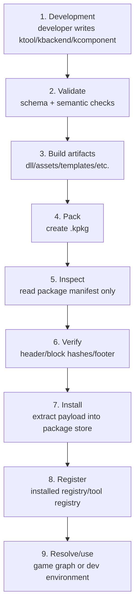

# Kanata package lifecycle v1

Status: draft  
Scope: development, packaging, inspection, verification, installation, resolution

## Lifecycle overview

```text
development
  -> validation
  -> build artifacts
  -> pack .kpkg
  -> inspect package
  -> verify package
  -> install package
  -> register installed metadata
  -> resolve/use
```



## Development

A developer writes a source manifest.

Examples:

```text
kanata.engineer.ktool
kanata.backend.monogame.kbackend
kanata.core.kcomponent
```

The source manifest describes the component and may reference source-build information:

```text
project
assemblyName
targetFramework
```

At this stage the component is not a package yet.

## Validation

Validation checks:

- manifest schema;
- required base fields;
- `kind` consistency;
- source project path;
- dependency ids;
- compatibility fields;
- game participation rules;
- type-specific fields.

For tools, validation must check:

- `kind` is `tool`;
- `commands[]` are valid;
- command names are not empty;
- command entry points are valid;
- `launchMode` is `process`;
- `gameParticipation.build` is `false`;
- `gameParticipation.runtime` is `false`.

## Build artifacts

The package process builds or collects artifacts.

Examples:

```text
Kanata.Engineer.dll
Kanata.Engineer.deps.json
Kanata.Engineer.runtimeconfig.json
Kanata.Backend.MonoGame.dll
assets
templates
```

Artifacts are later copied into `.kpkg` payload.

## Pack

`kanata package pack` creates `.kpkg`.

Pack does:

```text
read source manifests
validate source manifests
build or collect artifacts
normalize manifests into packaged descriptors
create package manifest
create installables index
create file table
write payload blocks
write integrity data
write footer
```

Important rule:

```text
Source manifest files do not have to be stored as payload files.
Canonical metadata is stored in installable descriptor blocks.
```

## Package info

`kanata package info <file.kpkg>` reads only metadata needed for display.

It reads:

- header;
- block table;
- package manifest.

It may skip:

- descriptor blocks;
- file table;
- payload;
- full hash verification.

Example output:

```text
Package: kanata.engineer
Version: 0.1.0

Installables:
  kanata.engineer
    Kind: tool
    Provides: kanata.engineering
    Game build: no
    Game runtime: no
    Platforms: windows
    Architectures: x64, arm64
```

## Package verify

`kanata package verify <file.kpkg>` fully checks package integrity.

It checks:

- header magic;
- format version;
- block table;
- block ranges;
- block hashes;
- manifest schema;
- descriptor schemas;
- file table;
- file hashes;
- footer hash.

It does not install the package.

It does not execute package code.

## Install

`kanata package install <file.kpkg>` verifies and installs a package.

Install pipeline:

```text
open package
verify package
check compatibility
check dependencies
extract payload to temp directory
verify extracted file hashes
atomically move to installed package store
write installed package metadata
update installed registry
update tool registry if tool components are present
```

Package installation must be atomic.

Failed install must not leave a package marked as installed.

## Installed package store

Suggested layout:

```text
~/.kanata/
  packages/
    cache/
      sha256/
        ab/
          abcdef.kpkg

    installed/
      kanata.engineer/
        0.1.0/
          abcdef/
            package.install.json
            descriptors/
              kanata.engineer.ktool.json
            files/
              tools/
                kanata.engineer/
                  Kanata.Engineer.dll
                  Kanata.Engineer.deps.json
                  Kanata.Engineer.runtimeconfig.json

    registry/
      installed.json
      tools.json
```

Installed package files should be treated as immutable.

Build output must not be written into installed package directories.

## Resolver interaction

Game resolver uses installed runtime/backend components.

Tool components are not game dependencies.

Tool components are resolved through installed environment/tool registry, not through the game runtime graph.

Current separation:

```text
game graph:
  runtime
  backend

development environment:
  tool
  editor
```

## Tool registration

When a package contains a `tool` installable, install may register tool metadata.

Example installed tool metadata:

```json
{
  "id": "kanata.engineer",
  "version": "0.1.0",
  "provides": ["kanata.engineering"],
  "commands": [
    {
      "name": "kanata-engineer",
      "description": "Runs Kanata Engineer.",
      "entryPoint": {
        "kind": "dotnet-assembly",
        "path": "tools/kanata.engineer/Kanata.Engineer.dll"
      },
      "launchMode": "process"
    }
  ]
}
```

Capability binding is not stored in the package.

Future installed environment state may contain:

```text
kanata.engineering -> kanata.engineer
```

## Safety rules

Package lifecycle safety rules:

- package install must not execute package code;
- package install must not run post-install scripts;
- package install must not write outside package store;
- package install must validate paths before extraction;
- package install must verify hashes;
- package install must write registry atomically;
- tool execution must happen only when explicitly invoked later.

## First implementation milestone

Milestone 1 should implement read-only package tooling:

```powershell
kanata package info
kanata package verify
```

Milestone 2 should implement package writing:

```powershell
kanata package pack
```

Milestone 3 should implement installation:

```powershell
kanata package install
```

Do not implement Engineer, capability resolver, sandbox, permissions, or remote registry in V1.
